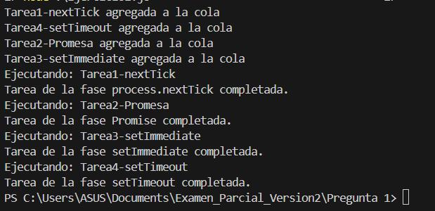

### Ejercicio 1: Simulación del event loop en Node.js con TypeScript


#### **Explicación del código**

Se implemento una simulación del Event Loop que destaca la diferencia entre microtareas (como process.nextTick y Promises) y macrotareas (como setTimeout y setImmediate).

##### Clases y Herencia

1. **Clase Abstracta `TareaAsincrona`**:
   - En esta parte de codigo se define la clase base con la estructura de una tarea asincrona con nombre y metodos abstractos,  para luego ser heredados por las clases hijas.

   - Contiene métodos para ejecutar la tarea y mostrar la información de la tarea.

   ```
   abstract class TareaAsincrona {
       protected nombre: string;
       constructor(nombre: string) {
           this.nombre = nombre;
       }

       abstract ejecutar(): void;

       infoTare(): string {
           return this.nombre;
       }

       mostrarDescri(): void {
           console.log(`Ejecutando: ${this.nombre}`);
       }
   }
   ``` 

En las siguiente clases se simula las diferentes fases de event loop, dichas clases heredan el metodo ejecutar de la clase base en este caso la clase TareAsincrona.

```
//Clase que simula una tarea con la fase setTimeout
class TareasetTimeout extends TareaAsincrona{
    ejecutar(): void {
        setTimeout(()=>{
            this.mostrarDescri();
            this.infoTare();
            console.log('Tarea de la fase setTimeout completada.');
        },1000);
    }
}

//Clase que simula una tarea con la fase setImmediate
class TareasetImmediate extends TareaAsincrona{
    ejecutar(): void {
        setImmediate(()=>{
            this.mostrarDescri();
            this.infoTare();
            console.log('Tarea de la fase setImmediate completada.');
        });
    }
}

//Clase que simula una tarea con la fase processNextTick
class TareaprocessNextTick extends TareaAsincrona{
    ejecutar(): void {
        process.nextTick(()=>{
            this.mostrarDescri();
            this.infoTare();
            console.log('Tarea de la fase process.nextTick completada.');
        });
    }
}

//Clase que simula una tarea con la fase Promise, devuelve una promesa
class TareaPromise extends TareaAsincrona{
    async ejecutar(): Promise<void> {
        this.mostrarDescri();
        console.log('Tarea de la fase Promise completada.');
    }
}
```

El siguiente codigo se define un interfaz INodo y la clase Nodo que implementa este interfaz. Además, tanto en el interfaz y en la clase se utilizan tipos genericos lo cual permitiran manejar cualquier tipo de tarea.

También, en el siguiente codigo se define la estructura de un nodo para luego utilizarlo para la implementacion de una cola FIFO para las tareas. 

```
// Interfaz para definir las propiedades de un nodo en la cola de tareas
interface INodo<T>{
    tarea:T;
    siguiente:INodo<T>|null; 
}
//Definición de Nodo para la cola de tareas
class Nodo<T> implements INodo<T>{
    tarea:T;
    siguiente:Nodo<T>|null; //Siguiente tarea

    constructor(tarea:T){
        this.tarea=tarea;
        this.siguiente=null;
    }
}

```
Después de implementar la estructura del nodo, definimos la clase cola FIFO para gestionar las tareas. 
Además, aplicamos encapsulación, poniendo las propiedades de la cola tanto la cabeza y la cola sean privadas y solo pueden ser manipuladas através de métodos de la clase.

```
//Cola FIFO para simular la encolación de tareas
class Cola<T>{
    private cabeza:INodo<T>|null;
    private cola:INodo<T>|null;

    constructor(){
        this.cabeza=null;
        this.cola=null;
    }

    //Metodo para encolar tareas
    encolar(tarea:T):void{
        const nuevoNodo =new Nodo(tarea);
        if(this.cola){
            this.cola.siguiente=nuevoNodo;
        }else{
            this.cabeza=nuevoNodo;
        }
        this.cola=nuevoNodo;
    }

    //Metodo para desencolar tareas
    desencolar():T|null{
        if(!this.cabeza) return null;
        const tarea=this.cabeza.tarea;
        this.cabeza=this.cabeza.siguiente;
        if(!this.cabeza){
            this.cola=null;
        }
        return tarea;
    }

    //Verificar si la cola está vacia
    estaVacia():boolean{
        return this.cabeza===null;
    }
}
```
Después se define la clase EventLoop, que manejara las tareas y ejecutarlas en el orden correcto segun la prioridad.
En este caso se hizo uso de polimorfismo, ya que permite diferente tipos de tareas sean tratadas a través de la instancia tarea.ejecutar(). Permitiendo un mejor manejo de las tareas.

```
//Definimos la clase EventLoop que simula el bucle de eventos y la gestion de tareas
class EventLoop{
    private cola:Cola<TareaAsincrona>;

    constructor(){
        this.cola=new Cola();
        
    }
    //metodo para agregar una tarea a la cola
    agregarTarea(tarea:TareaAsincrona){
        this.cola.encolar(tarea);
        console.log(`${[tarea.infoTare()]} agregada a la cola`)
    }
    ejecutarTareas(): void {
        // Priorizamos la ejecucion de la microtarea con la fase de process.nextTick
        while (!this.cola.estaVacia()) {
            const tarea = this.cola.desencolar();
            if (tarea instanceof TareaprocessNextTick) {
                tarea.ejecutar(); // Ejecutar nextTick 
            }else{
                // Para las siguientes tareas
                setTimeout(() => {
                     //Ejecución de la microtarea con la fase Promise
                    if(tarea instanceof TareaPromise){
                        tarea.ejecutar()
                            .then(result=>console.log(result))
                    }else{
                        tarea.ejecutar(); // Para las siguientes tareas
                    }
                    
                });
            }
        }
    }
}
```
En el siguiente codigo se crean instancias de diferentes tareas para agregar al event loop y se ejecutan las tareas  con ejecutarTareas. Para ello se transpila con npx tsc y se corre con node el archivo generado en .js. 

```
const evento= new EventLoop();
const tarea1=new TareaprocessNextTick("Tarea1-nextTick")
const tarea2=new TareaPromise("Tarea2-Promesa")
const tarea3=new TareasetImmediate("Tarea3-setImmediate")
const tarea4=new TareasetTimeout("Tarea4-setTimeout")

evento.agregarTarea(tarea1);
evento.agregarTarea(tarea4);
evento.agregarTarea(tarea2);
evento.agregarTarea(tarea3);
//Ejecutar el event loop
evento.ejecutarTareas();
```

Obteniendo como resultado lo siguiente:



Al inicio se encolan las tareas. Luego se ejecutan las microtareas que  son aquellas que se ejecutan inmediatamente después de que el codigo sincronico ha terminado. Estas tienen mayor prioridad que las macrotareas. Las fases que incluye las microtareas son las promesas y el process.nextTick. Estas se ejecutan primero. Luego se ejecutan las Macrotareas que son las otras tareas asíncronas que se ejecutan las fases de setTimeout y setImmediate.
