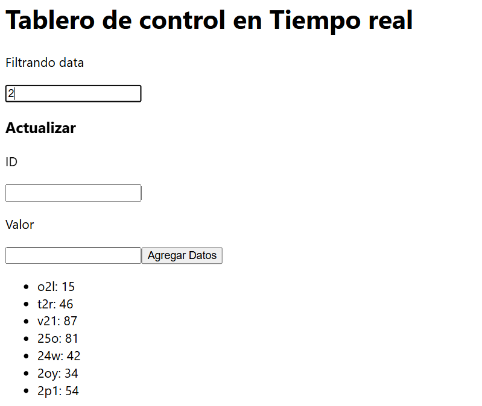
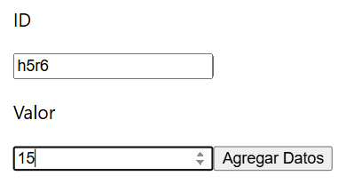
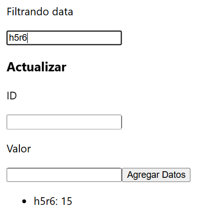
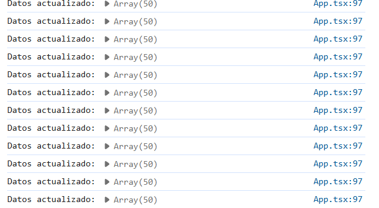

## Documentación de la Aplicación React con Hooks Personalizados y manejo del estado

## Descripción

Esta aplicación React simula un tablero de control en tiempo real que muestra datos actualizados cada cierto intervalo. 
Permite al usuario filtrar y manipular la información presentada.

Ubicacion de los codigos = \myapp\src 

### Características

- Datos simulados generados aleatoriamente.
- Filtro de datos mediante un campo de entrada.
- Simulacion de actualización de datos manualmente.
- Registro en la consola del ciclo de vida de los datos, a traves de logs en la consola.

### Explicación de partes del codigo 


```
//Definir una accion para useReducer
//En este caso, la acción es de tipo actualizar y en payload con los nuevos valores
type DataAccion={
  type:'Actualizar';
  payload:Array<Valores>
}

//Se define la siguiente función para manejar el estado global 
//La acción actualizar añade nuevos datos y mantiene solo los ultimos 50 elementos en el estado
const dataReducer=(estado:Data,accion:DataAccion):Data=>{
  switch(accion.type){
    case 'Actualizar':
      const nuevosDatos = [...estado.data, ...accion.payload];
      return { ...estado, data: nuevosDatos.slice(-50) }; //Mantener solo los ultimos 50 elementos
    default:
      return estado;
  }
}

```
El tipo DataAccion define las acciones que se pueden realizar sobre el estado y la función dataReducer actualiza el estado global basado en la acción recibida.


```
/*
 * Definimos el componente App
 * @hook {useReducer} ->para manejar el estado global
 * @hook {useState} ->para manejar el valor actual del filtro
 * @hook {useRef} -> para referenciar elementos del DOM directamente (input de filtro, nuevo ID, nuevo valor)
 * @tipo {HTMLInputElement} --> representa a un elemento que en este caso es <input> del DOM.Permiteindo acceder a las propiedades como value
 * @returns JSX
 */
function App() {
  const[estado,dispatch]=useReducer(dataReducer,Inicial);
  const[filtro,setFiltro]=useState('');
  const entradaRef=useRef<HTMLInputElement>(null); 
  const nuevoRef=useRef<HTMLInputElement>(null);
  const nuevoValorRef=useRef<HTMLInputElement>(null);

```

Definimos el componente funcional App que gestiona el estado y la lógica de la aplicación.

entradaRef, nuevoRef, nuevoValorRef son referencias a elementos del DOM para manejar entradas de usuario.

El siguiente linea de codigo  se define la variable filtrarData que contendra los datos filtrados basados en el estado actual y el filtro aplicado. Y se hace uso de un hook personalizado.

```
// Filtramos datos
  const filtrarData = useFiltro(estado.data, filtro);

```
El hook personalizado esta en el archivo hookPersonalizado.ts lo cual se encarga de hacer el filtro. Para ello se hace uso del hook useMemo.

```
import { useMemo } from "react";

type Valores={
    id:string,
    value:number,
  }
//Hook personalizado para filtrar datos por caracteres del id
export function useFiltro(data:Array<Valores>,filtro:string){
    return useMemo(()=>{
        return data.filter(item=>item.id.includes(filtro));
    },[data,filtro]);
}

```

El siguiente codigo se simula el tablero de contro en tiempo real que cada 3 segundos, se actualiza el estado.

```
//Simula la llegada de los datos actualizados en tiempo real en un itervalo de cada 3 segundos
  useEffect(() => {
    const intervalo = setInterval(() => {
      //Se muestran cada 5 datos aleatorios
      const randomData: Array<Valores> = Array.from({ length: 5 }, () => ({
        id: Math.random().toString(36).substring(2, 5), // id: es alfanumerico
        value: Math.floor(Math.random() * 100) //value: va tener entre valores de 0 a 100
      }));
      //Actualiza el estado con los datos generados
      dispatch({ type: 'Actualizar', payload: randomData });
    }, 3000); // Actualiza cada 3 segundos

    //Limpia el intervalo cuando el componente se desmonta
    return () => clearInterval(intervalo);
  }, [dispatch]);

```

Renderización
Retorna el JSX

```
return (
    <div className="App">
    <h1>Tablero de control en Tiempo real</h1>
    <p>Filtrando data</p>
    <input
      ref={entradaRef} //Referencia al campo de entrada
      type="text"
      onChange={actualizarFiltro} // Actualizar el filtro cuando cambie el valor
    />
    <div>
        <h3>Actualizar</h3>
        <p>ID</p>
        <input
          ref={nuevoRef} //Referencia al campo nuevo
          type="text"
        />
        <p>Valor</p>
        <input
          ref={nuevoValorRef}
          type="number"
        />
        <button onClick={agregarDatos}>Agregar Datos</button> 
      </div>
    <ul>
      {filtrarData.length === 0 ? (
        <li>No se encontraron datos</li> // Mensaje si no hay datos que coincidan con el filtro
      ) : (
        filtrarData.map((item) => (
          <li key={item.id}>{item.id}: {item.value}</li>// Mostrar los datos filtrados
        ))
      )}
    </ul>
  </div>
    );
  
}
```
Para la ejecución de los codigo ingrese con cd myapp y luego con **npm start**, en la consola.

Obteniendo los siguientes resultados:

Cuando el usuario quiero filtar la data:

Se muestra los id que contiene el numero 2 en el su nombre:




Ahora, una simulación cuando el usuario quiere cambiar un valor de un ID. 
Va ingresar el ID y el valor que quiere asignar:



Ahora para observar que se actualizo o mejor dicho que se agrego lo filtramos segun el nombre:




Ahora lo logs generados en la consola:

