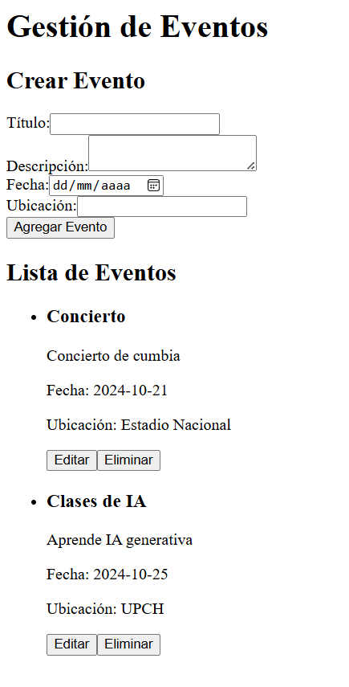
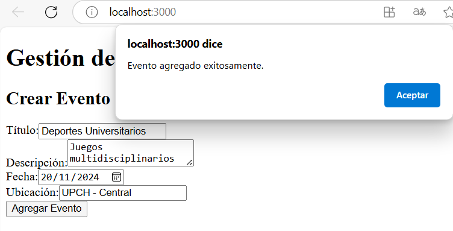
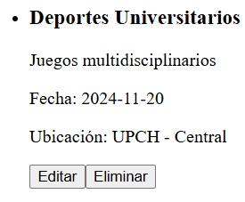
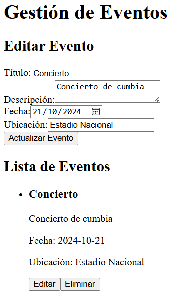
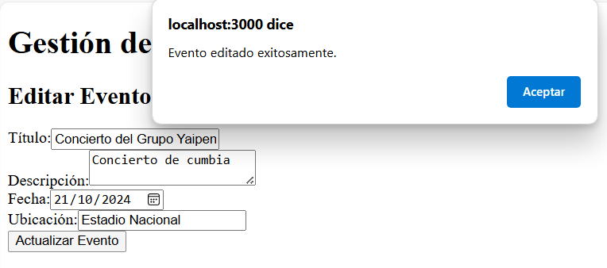
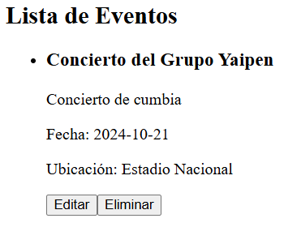
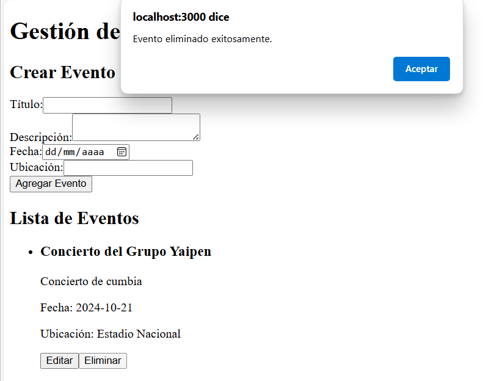
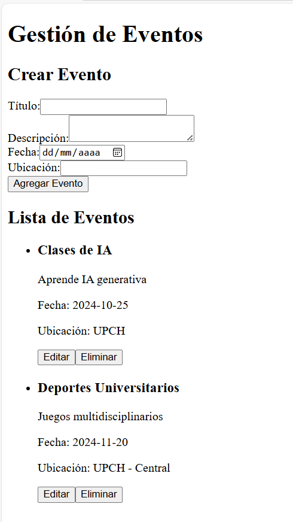

# Documentación de la Aplicación de Gestión de Eventos

Esta aplicación permite a los usuarios crear, editar y eliminar eventos. 

El ejercicio 3 consta de los siguientes archivos principales:

\myapp\src\

- `App.js`
- `Crear_Editar_Evento.js`
- `Lista_Eventos.js`

## 1. `App.js`

Este archivo contiene el componente funcional de la aplicación, donde se gestiona el estado de los eventos utilizando reducer.

### Código

```
import React,{useReducer,useState,useEffect} from 'react';
import EventoFormu from './Crear_Editar_Evento';
import EventoLista from './Lista_Eventos';

import './App.css';

/**
 * Reducer para manejar el estado de eventos.
 * 
 * @param {Array} state - Estado actual de los eventos.
 * @param {Object} action - Objeto de acción que contiene el tipo de acción y la carga útil.
 * @returns {Array} - Nuevo estado de los eventos.
 */

const eventoReducer = (state, action) => {
  switch (action.tipo) {
      case 'Añadir_Evento':
          alert("Evento agregado exitosamente.");
          // Asegurarse de no agregar duplicados
          const eventosExistentesIds = new Set(state.map(evento => evento.id));
          const nuevosEventos = action.payload.filter(evento => !eventosExistentesIds.has(evento.id));
          return [...state, ...nuevosEventos];

      case 'Editar_Evento':
          alert("Evento editado exitosamente.");
          return state.map(evento => 
              evento.id === action.payload.id ? action.payload : evento
          );
      case 'Eliminar_Evento':
          alert("Evento eliminado exitosamente.");
          return state.filter(evento => evento.id !== action.payload);
      default:
          return state;
  }
};

// Componente funcional App
const App = () => {
  const [eventos, dispatch] = useReducer(eventoReducer, []);
  const [eventEditar, setEventEditar] = useState(null);
  // Simulación de una operación asíncrona 
  useEffect(() => {
    const fetchEvents = () => {
        return new Promise((resolve) => {
            setTimeout(() => resolve([
                { id: 1, titulo: "Concierto", descripcion: "Concierto de cumbia", date: "2024-10-21", ubicacion: "Estadio Nacional" },
                { id: 2, titulo: "Clases de IA", descripcion: "Aprende IA generativa", date: "2024-10-25", ubicacion: "UPCH" },
            ]), 1000);
        });
    };

    fetchEvents()
        .then((events) => dispatch({ tipo: 'Añadir_Evento', payload: events }))
        .catch((error) => console.error("Error cargando eventos", error));
  }, []);
  // JSX -> Elemento renderizado de la aplicación.
  return (
      <div>
        <h1>Gestión de Eventos</h1>
          <EventoFormu dispatch={dispatch} eventEditar={eventEditar} setEventEditar={setEventEditar}/>
          <EventoLista eventos={eventos} dispatch={dispatch} setEventEditar={setEventEditar} />
      </div>
  );
};

export default App;

```
Con la función eventoReducer se maneja tres tipos de acciones:

Añadir_Evento: Agrega un nuevo evento al estado.
Editar_Evento: Modifica un evento existente.
Eliminar_Evento: Elimina un evento del estado.

En el componente funcional app: 
useReducer se utiliza para manejar el estado de los eventos, y useState se usa para el evento que se está editando.

Además se realiza de una simulación de una opercion asincronica como una llamada de una API utilizando promesas.

```
// Simulación de una operación asíncrona 
  useEffect(() => {
    const fetchEvents = () => {
        return new Promise((resolve) => {
            setTimeout(() => resolve([
                { id: 1, titulo: "Concierto", descripcion: "Concierto de cumbia", date: "2024-10-21", ubicacion: "Estadio Nacional" },
                { id: 2, titulo: "Clases de IA", descripcion: "Aprende IA generativa", date: "2024-10-25", ubicacion: "UPCH" },
            ]), 1000);
        });
    };

    fetchEvents()
        .then((events) => dispatch({ tipo: 'Añadir_Evento', payload: events }))
        .catch((error) => console.error("Error cargando eventos", error));
  }, []);
```

Por ultimo, se renderizan los componetes EventoFormu y EventoLista, pasando las propiedades necesarias.

## 2. `Crear_Editar_Evento.js`

Este archivo contiene el componente funcional para crear o editar eventos. Incluye un formulario para ingresar los detalles del evento.

### Explicación del Código

```
const EventoFormu = ({ dispatch, eventEditar,setEventEditar }) => {
    const [titulo, setTitulo] = useState('');
    const [descripcion, setDescripcion] = useState('');
    const [date, setDate] = useState('');
    const [ubicacion, setUbicacion] = useState('');

    // Efecto para cargar los datos del evento a editar
    useEffect(() => {
      if ( eventEditar) {
        setTitulo( eventEditar.titulo);
        setDescripcion( eventEditar.descripcion);
        setDate( eventEditar.date);
        setUbicacion( eventEditar.ubicacion);
      }
    }, [ eventEditar]);

```
Se utilizan estados useState para manejar los datos del formulario y useEffect para cargar los datos del evento cuando se está editando.

Tambien se resetea el formulario después de agregar o editar un evento con la funcion limpiarFormu.

## 3. `Lista_Eventos.js`

Este archivo contiene el componente funcional que muestra la lista de eventos y permite a los usuarios editarlos o eliminarlos.

### Explicación del Código

Las funciones manejarEliminar y manejarEditar manejan la eliminación y edición de eventos respectivamente.

```
/**
     * Maneja la eliminación de un evento.
     * @param {string} id - ID del evento a eliminar.
     */
    const manejarEliminar = (id) => {
        dispatch({ tipo: 'Eliminar_Evento', payload: id });
    };

    /**
     * Maneja la edición de un evento. 
     * @param {Object} evento - Evento que se va a editar.
     */
    const manejarEditar = (evento) => {
        setEventEditar(evento);
    };
```

Se utiliza un map para recorrer y mostrar cada evento en la lista, incluyendo botones para editar y eliminar.


### Ejecución y Salida

Ejecucion con: npm start

Salidas:

La aplicación mostrará un formulario donde puedes agregar nuevos eventos o editar eventos existentes.



Cuando el usuario desea agregar un evento, va ver un mensaje de éxito.




Una vez dado clic en aceptar:
En la lista de Eventos tendremos el evento agragado:



Cada evento tiene botones para editar y eliminar.

Si desea editar un evento solo hace clic en el botón editar:



Y se puede modificar las propiedades del evento:

Al momento de dar clic en el boton actualizar evento, va ver un mensaje de exito de la edición:



Como resultado tenemos lo siguiente:




Y por ultimo para eliminar se hace clic al botón eliminar que esta en el parte inferior del evento:

Se va ver un mensaje de exito de la eliminacion:



Dando como resultado lo siguiente:


