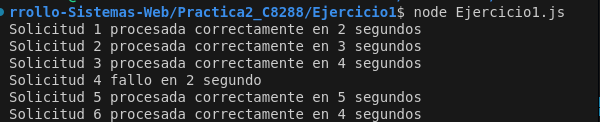

//con callbacks
```
function procesarSolicitud(tiempo,solicitud,callback){
    let n =0;
    const tiempos=tiempo*1000;
    const pila=[];
    let demora=Math.floor(Math.random()*5) //tiempo de espera
    while(n<=tiempos){
        n++
        if (n===2){
            let demorasegu=demora*1000
            while(n<=demorasegu){
                n++
            }
        }
    }
    const errores=Math.random()<0.2;
    if (errores){
        callback(new Error(`Solicitud ${solicitud.id} fallo en ${demora} segundo`));
        
    }else if(pila.length<=5){
            const resultado=`Solicitud ${solicitud.id} procesada correctamente en ${tiempo} segundos`
            pila.push(solicitud);
            callback(null,resultado)
        
    }
    
    

}
```

En esta aparte del codigo simulo un temporizador  y asimismo simulo que los errores de las solicitudes fallan aleatoriamente durante el procesamiento
cada solicitud tarda en procesarse entre 1 a 5 segundos.

Además hago manejo de errores simulado el 20%
de solicitudes fallan


como resultado me da la siguiente:




